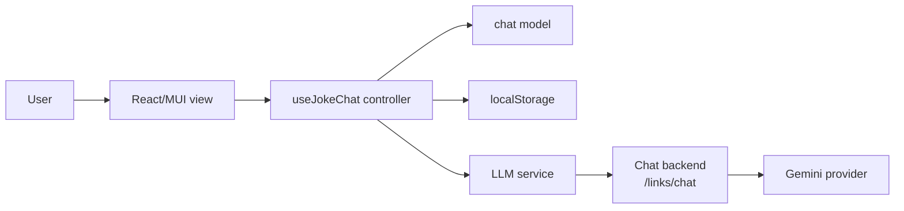
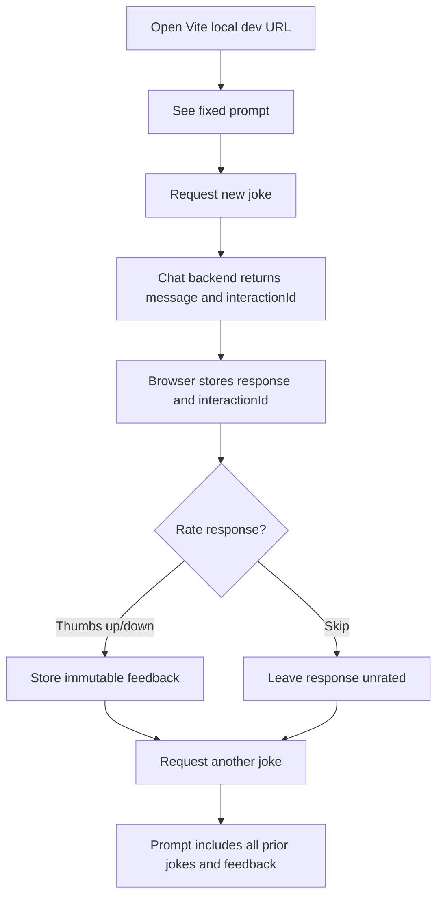

# Architecture

## System Design

The domain model in `app/src/models/chat.ts` owns response shape, prompt construction, JSON response parsing, truncation, and feedback immutability. The controller in `app/src/controllers/useJokeChat.ts` handles browser persistence and UI state. The service in `app/src/services/llm.ts` sends documented `/links/chat` requests shaped as `{message, previousInteractionId}` and accepts backend `message` output only when it can be parsed as `{"text":"..."}`.

## User Journey

## Kernel Trace

`INV-001` is implemented by `ChatResponse.rating?: UserRating`. It is optional when a response is created and immutable after the first thumbs up or thumbs down rating.
