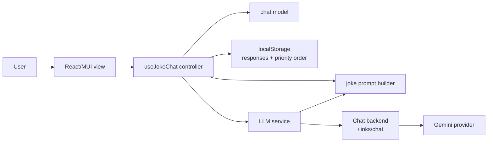
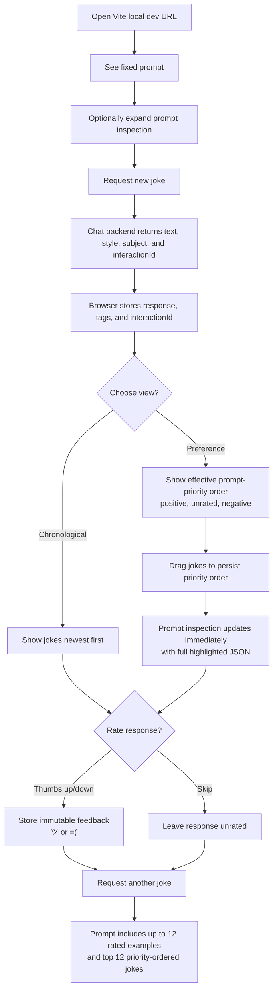

# Architecture

## System Design

The domain model in `app/src/models/chat.ts` owns response shape, JSON response parsing, truncation, tag validation, storage validation, feedback immutability, and deterministic priority ordering. The prompt builder in `app/src/prompts/jokePrompt.ts` owns the fixed prompt contract, structured response instructions, rated-history selection, priority-ordered context selection, and prompt inspection text. The controller in `app/src/controllers/useJokeChat.ts` handles browser persistence for responses and priority order, UI state, and next-prompt derivation. The service in `app/src/services/llm.ts` sends documented `/links/chat` requests shaped as `{message, previousInteractionId}` and accepts backend `message` output only when it can be parsed as structured joke JSON with `text`, `style`, and `subject`.

## User Journey

## Kernel Trace

`INV-001` is implemented by `ChatResponse.rating?: UserRating`. It is optional when a response is created and immutable after the first thumbs up or thumbs down rating.

`INV-002` is implemented by required `ChatResponse.style` and `ChatResponse.subject` tag arrays. LLM responses and local storage records without non-empty tag arrays are rejected.

V3 priority is implemented as a separate browser-persisted `priorityOrder` list. Before manual ordering, preference view defaults to thumbs-up jokes, unrated jokes, then thumbs-down jokes, newest first within each group. Dragging in preference view changes only the order used for priority context; it does not change `ChatResponse.rating`. The prompt builder emits rating-selected examples and priority-ordered examples as separate labeled sections, using pretty-printed JSON for prompt inspection readability.
