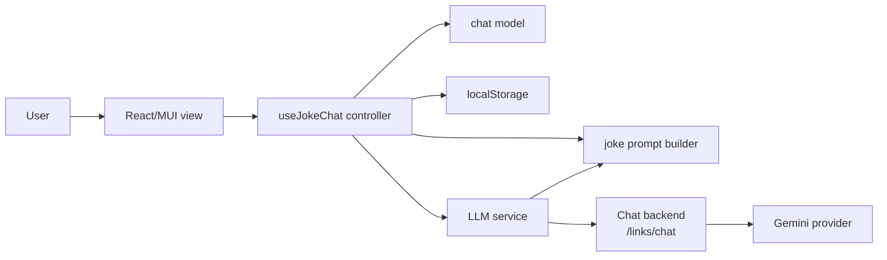
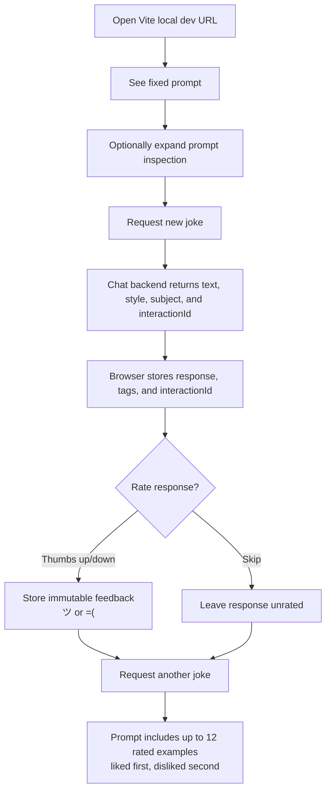

# Architecture

## System Design

The domain model in `app/src/models/chat.ts` owns response shape, JSON response parsing, truncation, tag validation, storage validation, and feedback immutability. The prompt builder in `app/src/prompts/jokePrompt.ts` owns the fixed prompt contract, structured response instructions, rated-history selection, and prompt inspection text. The controller in `app/src/controllers/useJokeChat.ts` handles browser persistence, UI state, and next-prompt derivation. The service in `app/src/services/llm.ts` sends documented `/links/chat` requests shaped as `{message, previousInteractionId}` and accepts backend `message` output only when it can be parsed as structured joke JSON with `text`, `style`, and `subject`.

## User Journey

## Kernel Trace

`INV-001` is implemented by `ChatResponse.rating?: UserRating`. It is optional when a response is created and immutable after the first thumbs up or thumbs down rating.

`INV-002` is implemented by required `ChatResponse.style` and `ChatResponse.subject` tag arrays. LLM responses and local storage records without non-empty tag arrays are rejected.
